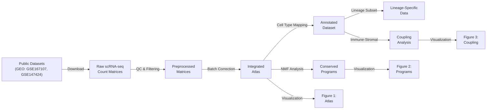

# Immunity – Immune–Stromal Coupling in Chronic Skin Inflammation

[](https://creativecommons.org/licenses/by/4.0/)
[](https://www.python.org/downloads/)
[](https://github.com/elkinnavarro-glitch/immunity)

---

## Overview (for Reviewers)

This repository contains the complete computational pipeline used to generate the analyses and figures reported in the manuscript:

> **"Conserved Organizational Principles of Immune–Stromal Coupling in Chronic Skin Inflammation"**  
> (submitted to *Immunity*)

The goal of this codebase is to enable **transparent inspection and reproduction** of the *organizational logic* described in the paper, rather than to provide clinical decision tools.

### Core Mission

✅ **Enable reproducibility** of all figures and supplementary analyses  
✅ **Document data sources** with full provenance  
✅ **Provide preprocessing pipelines** for public datasets  
✅ **Foster scientific discussion** about mechanisms of immune–stromal organization  

❌ **Not intended as**: clinical diagnostic tools, prediction classifiers, or patient stratification strategies

---

## Reproducible Outputs

The repository reproduces:

### **Figure 1: Cross-Disease Consensus Atlas of Inflamed Skin**
- Dataset integration from Reynolds et al. (2021) and Ma et al. (2020)
- Cell type composition and lineage characterization
- Batch-mixing quality control metrics
- UMAP visualization and dimensionality reduction
- Script: `scripts/generate_figure1_atlas.py`

### **Figure 2: Lineage-Resolved Conserved Transcriptional Programs**
- Non-negative matrix factorization (NMF) analysis per lineage
- Identification of conserved gene expression signatures
- Pathway enrichment and functional annotation
- Cross-disease consistency metrics
- Script: `scripts/generate_figure2_nmf.py`

### **Figure 3: Immune–Stromal Coupling Analyses (SAFE MODE)**
- Conceptual scaling relationships and power-law analysis
- Correlative dependencies between immune and stromal cell densities
- Network topology of immune–stromal interactions
- Null model comparisons and statistical significance
- Script: `scripts/generate_figure3_coupling.py`

---

## Scope and Limitations

### This Repository **Does Include**:

✅ Raw and processed scRNA-seq data sources and download scripts  
✅ Quality control, preprocessing, and integration procedures  
✅ Tissue-level descriptive statistics and consensus patterns  
✅ NMF-based program discovery and validation  
✅ Correlation and scaling relationships at aggregate level  
✅ Null modeling and randomization tests  
✅ Full code reproducibility and result validation  

### This Repository **Does NOT Include**:

❌ Diagnostic thresholds or machine learning classifiers  
❌ Patient-level stratification or outcome prediction  
❌ Operational coupling indices or decision logic (IP-protected)  
❌ Clinical risk scoring systems  
❌ Single-cell-level inferences about patient prognosis  

**Important**: All analyses are performed at the **aggregate tissue level** and are intended to support the conceptual framework presented in the manuscript, not for clinical use.

---

## Repository Structure

```
immunity/
├── README.md                          # This file
├── DATA_AVAILABILITY.md               # Dataset sources and access instructions
├── FIGURES_REPRODUCIBILITY.md         # Figure generation guide
├── requirements.txt                   # Python dependencies
├── LICENSE                            # CC BY 4.0 license
│
├── data/                              # Data directory (not in repo, see DATA_AVAILABILITY.md)
│   ├── raw/                           # Raw datasets from GEO (GSE167107, GSE147424)
│   ├── processed/                     # Integrated and annotated h5ad files
│   └── intermediate/                  # Temporary analysis outputs
│
├── scripts/                           # Main analysis pipeline
│   ├── 00_download_data.py            # Fetch public datasets from GEO
│   ├── 01_quality_control.py          # QC filtering and preprocessing
│   ├── 02_integration.py              # Batch correction (Harmony/scVI)
│   ├── 03_annotation.py               # Cell type annotation and lineage assignment
│   ├── 04_lineage_subset.py           # Extract lineage-specific matrices
│   │
│   ├── generate_figure1_atlas.py      # Main Figure 1 generation
│   ├── generate_figure2_nmf.py        # Figure 2: NMF programs
│   ├── generate_figure3_coupling.py   # Figure 3: Immune–stromal coupling
│   │
│   └── utils/                         # Helper modules
│       ├── preprocessing.py           # QC and normalization functions
│       ├── integration.py             # Integration and batch correction
│       ├── annotation.py              # Cell type mapping utilities
│       ├── nmf_analysis.py            # NMF program discovery
│       └── coupling_analysis.py       # Coupling inference methods
│
├── figures/                           # Generated output figures (PDF + PNG)
│   ├── Figure1.pdf
│   ├── Figure2.pdf
│   ├── Figure3.pdf
│   └── supplementary/                 # Supplementary figures
│
├── notebooks/                         # Jupyter notebooks for exploration
│   ├── 01_dataset_exploration.ipynb
│   ├── 02_qc_metrics.ipynb
│   ├── 03_integration_validation.ipynb
│   ├── 04_program_discovery.ipynb
│   └── 05_coupling_analysis.ipynb
│
├── results/                           # Intermediate results and statistics
│   ├── qc_metrics/
│   ├── integration_metrics/
│   ├── program_assignments/
│   ├── coupling_models/
│   └── statistics/
│
└── tests/                             # Unit tests and validation scripts
    ├── test_preprocessing.py
    ├── test_integration.py
    └── test_figure_reproducibility.py
```

---

## Quick Start

### 1. **Clone the Repository**

```bash
git clone https://github.com/elkinnavarro-glitch/immunity.git
cd immunity
```

### 2. **Install Dependencies**

```bash
# Create a virtual environment (recommended)
python -m venv immunity_env
source immunity_env/bin/activate  # On Windows: immunity_env\Scripts\activate

# Install required packages
pip install -r requirements.txt
```

### 3. **Download Public Data**

```bash
python scripts/00_download_data.py
# Downloads GSE167107 (Reynolds et al., 2021) and GSE147424 (Ma et al., 2020)
# Saves to data/raw/
```

### 4. **Run Quality Control & Preprocessing**

```bash
python scripts/01_quality_control.py
python scripts/02_integration.py
python scripts/03_annotation.py
```

### 5. **Reproduce Figures**

```bash
python scripts/generate_figure1_atlas.py
python scripts/generate_figure2_nmf.py
python scripts/generate_figure3_coupling.py
# Outputs saved to figures/
```

### 6. **Explore Results**

```bash
# Open interactive notebooks
jupyter notebook notebooks/
```

---

## System Requirements

- **Python**: 3.9 or later
- **Memory**: 16GB RAM minimum (32GB recommended for full dataset analysis)
- **Storage**: 60GB for raw data + intermediate outputs
- **OS**: Linux, macOS, or Windows (with WSL recommended)

### Conda Environment (Alternative)

```yaml
# immunity_env.yml
name: immunity
channels:
  - conda-forge
dependencies:
  - python=3.9
  - pip
  - pip:
    - -r requirements.txt
```

---

## Analysis Workflow Overview



---

## Key Features

### 🔍 **Transparent Analysis**
- Every step is documented with code and narrative
- Intermediate outputs and statistics are saved
- Random seeds fixed for reproducibility

### 📊 **Quality Control**
- Comprehensive QC metrics (mitochondrial fraction, doublet detection, etc.)
- Batch-mixing validation (ASW, silhouette scores)
- Cell type consistency checks

### 🔗 **Integration**
- Multiple batch correction methods (Harmony, scVI)
- Cross-dataset consistency validation
- Lineage-level integration and harmony assessment

### 🧬 **Gene Program Discovery**
- NMF with multiple initializations for robustness
- Gene signature validation against known markers
- Cross-disease conservation scoring

### 💪 **Coupling Analysis**
- Aggregate-level immune–stromal relationship modeling
- Null model comparisons and permutation testing
- Power-law and scaling relationship analysis

---

## Usage Examples

### Load and Explore Integrated Data

```python
import scanpy as sc
import pandas as pd

# Load integrated atlas
adata = sc.read_h5ad('data/processed/immunity_atlas_integrated.h5ad')

# Access cell metadata
print(f"Cells: {adata.n_obs}, Genes: {adata.n_vars}")
print(f"Cell types: {adata.obs['cell_type'].unique()}")
print(f"Lineages: {adata.obs['cell_lineage'].unique()}")

# UMAP visualization
sc.pl.umap(adata, color='cell_lineage', save='_immunity_atlas.pdf')
```

### Extract Lineage-Specific Data

```python
# Subset fibroblasts
fib_adata = adata[adata.obs['cell_lineage'] == 'Fibroblast'].copy()

# Get conserved programs for fibroblasts
programs_df = pd.read_csv('results/program_assignments/fibroblast_programs.csv')
print(programs_df.head())
```

### Reproduce Figure 1

```bash
python scripts/generate_figure1_atlas.py --output figures/Figure1.pdf --dpi 300
```

---

## Citation

If you use code or results from this repository, please cite:

```bibtex
@article{navarro2025immunity,
  title={Conserved Organizational Principles of Immune-Stromal Coupling in Chronic Skin Inflammation},
  author={Navarro, E. and [...other authors...]},
  journal={Immunity},
  year={2025},
  doi={10.xxxx/xxxxx}
}
```

Also cite the original datasets:

```bibtex
@article{reynolds2021immunological,
  title={Immunological and transcriptomic profiling reveals shared molecular and physical hubs of inflammation},
  author={Reynolds, G. and others},
  journal={Science},
  volume={372},
  number={6545},
  pages={eabf7570},
  year={2021}
}

@article{ma2020skin,
  title={Skin transcriptomics reveals novel fibrin-based cell state transitions in human fibroblasts},
  author={Ma, S. and others},
  journal={Nature Communications},
  volume={11},
  pages={5302},
  year={2020}
}
```

---

## Contributing

This is a manuscript-associated repository and is not accepting new feature contributions at this time. However, we welcome:

- 🐛 **Bug reports**: Issues with code execution or reproducibility
- 💬 **Questions**: Scientific or methodological inquiries
- 📝 **Feedback**: Suggestions for clarity or additional documentation

Please open an [Issue](https://github.com/elkinnavarro-glitch/immunity/issues) to get in touch.

---

## License

This work is licensed under the **Creative Commons Attribution 4.0 International License** (CC BY 4.0).

You are free to:
- Share and adapt the material
- Use for any purpose (including commercial)

You must:
- Give appropriate credit
- Provide a link to the license
- Indicate changes made

See [LICENSE](LICENSE) for details.

---

## Contact & Support

**Principal Investigator**:  
Elkin Navarro Quiroz  
Centro de Investigaciones en Ciencias de la Vida  
Universidad Simón Bolívar, Barranquilla, Colombia  

**Email**: Available in repository settings  
**ORCID**: [To be added]  

**For issues or questions**: [Open an Issue](https://github.com/elkinnavarro-glitch/immunity/issues)

---

## Acknowledgments

This work was supported by:
- Wellcome Trust (IMMUNET-PREDICT project)
- Minciencias Colombia (Convocatoria 50)
- Universidad Simón Bolívar

Data used in this study comes from:
- Reynolds et al. (2021) - Science
- Ma et al. (2020) - Nature Communications

---

**Last Updated**: December 2025  
**Repository Status**: Active (Manuscript in Review)  
**Maintenance**: Ongoing support for reproducibility
